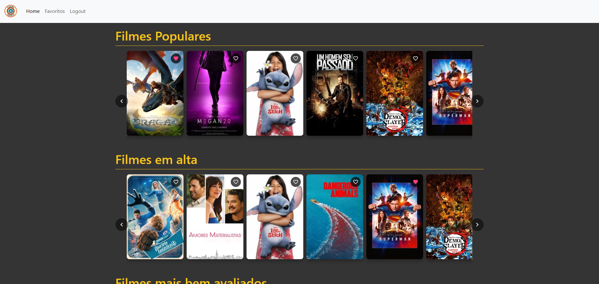

# 🎬 Cine Explorer

Projeto de exibição de filmes, realizado com Nuxt 3, que permite login (apenas simbolico e para separar os favoritos), favoritar filmes, olhar suas sinopses e a acessar dados da API do TMDB.

---

# 📷 Demonstração

# URL do site
https://tmdb-front.vercel.app/

---

# 🛠️ Tecnologias Utilizadas

- [Nuxt 3](https://nuxt.com/)
- [TypeScript](https://www.typescriptlang.org/)
- [useBootstrap](https://usebootstrap.org/)
- [Pinia](https://pinia.vuejs.org/)
- [TMDB API](https://developer.themoviedb.org/docs/getting-started)
- [Nuxt test uyils](https://nuxt.com/docs/3.x/getting-started/testing)

---

# 📦 Instalação

## 1. Clone o repositório
git clone https://github.com/GustavoSilvaAguiar/tmdb_front.git

## 2. Acesse a pasta
cd seu-repo

## 3. Instale as dependências
npm install

## 4. Crie um arquivo .env com as chaves da API
duplique o arquivo .env copy e o renomeie para .env e coloque seu token

## 5. Rode o servidor de desenvolvimento
npm run dev

---

# 📦 Build para Produção

npm run build

npm run preview

---

# 🧪 Testes

npm run test:dev

---

# 🚀 Funcionalidades 

- Listagem de filmes populares
- Listagem de filmes em alta
- Página de favoritos (armazenados em localhost)
- Sistema de login e logout simulados
- Layout responsivo

---

# 💡 Sugestões de Melhoria

- Implementar autenticação e criação de contas em um back-end próprio
- Adicionar mais informações dos filmes
- Adicionar mais opções de pesquisa e navegação
- Explorar mais as possibilidades da API da TMDB
- Melhorar a performance do site
- Melhorar o design do site
